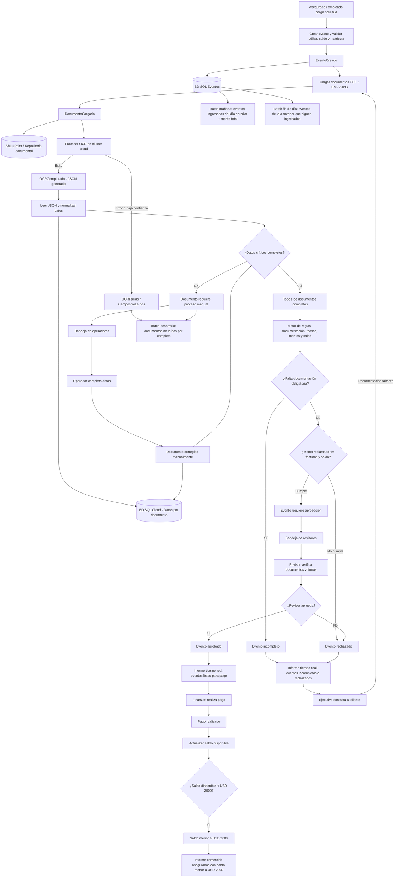

# McareSeguros

```mermaid
flowchart TD

    A["Asegurado / empleado carga solicitud"]
    --> P1["Crear evento y validar póliza, saldo y matrícula"]

    P1 --> E1["EventoCreado"]
    E1 --> DBE[("BD SQL Eventos")]
    E1 --> P2["Cargar documentos PDF / BMP / JPG"]

    P2 --> E2["DocumentoCargado"]
    E2 --> REPO[("SharePoint / Repositorio documental")]
    E2 --> P3["Procesar OCR en cluster cloud"]

    P3 -->|Éxito| E3["OCRCompletado - JSON generado"]
    P3 -->|Error o baja confianza| E3B["OCRFallido / CamposNoLeídos"]

    E3 --> P4["Leer JSON y normalizar datos"]
    P4 --> DBD[("BD SQL Cloud - Datos por documento")]
    P4 --> D1{"¿Datos críticos completos?"}

    D1 -->|No| E4["Documento requiere proceso manual"]

    E4 --> BOP["Bandeja de operadores"]
    BOP --> P5["Operador completa datos"]
    P5 --> E5["Documento corregido manualmente"]

    E5 --> DBD
    E5 --> D1

    D1 -->|Sí| E6["Todos los documentos completos"]

    E6 --> P6["Motor de reglas: documentación, fechas, montos y saldo"]

    P6 --> D2{"¿Falta documentación obligatoria?"}

    D2 -->|Sí| E7["Evento incompleto"]

    D2 -->|No| D3{"¿Monto reclamado <= facturas y saldo?"}

    D3 -->|No cumple| E8["Evento rechazado"]
    D3 -->|Cumple| E9["Evento requiere aprobación"]

    E9 --> BREV["Bandeja de revisores"]

    BREV --> P7["Revisor verifica documentos y firmas"]

    P7 --> D4{"¿Revisor aprueba?"}

    D4 -->|No| E8
    D4 -->|Sí| E10["Evento aprobado"]

    E10 --> R1["Informe tiempo real: eventos listos para pago"]

    R1 --> P8["Finanzas realiza pago"]

    P8 --> E11["Pago realizado"]

    E11 --> P9["Actualizar saldo disponible"]

    P9 --> D5{"¿Saldo disponible < USD 2000?"}

    D5 -->|Sí| E12["Saldo menor a USD 2000"]

    E12 --> R2["Informe comercial: asegurados con saldo menor a USD 2000"]

    E7 --> R3["Informe tiempo real: eventos incompletos o rechazados"]
    E8 --> R3

    R3 --> P10["Ejecutivo contacta al cliente"]

    P10 -->|Documentación faltante| P2

    E3B --> R4["Batch desarrollo: documentos no leídos por completo"]
    E4 --> R4

    DBE --> R5["Batch mañana: eventos ingresados del día anterior + monto total"]

    DBE --> R6["Batch fin de día: eventos del día anterior que siguen ingresados"]
```
